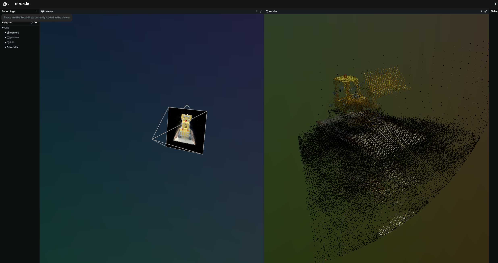
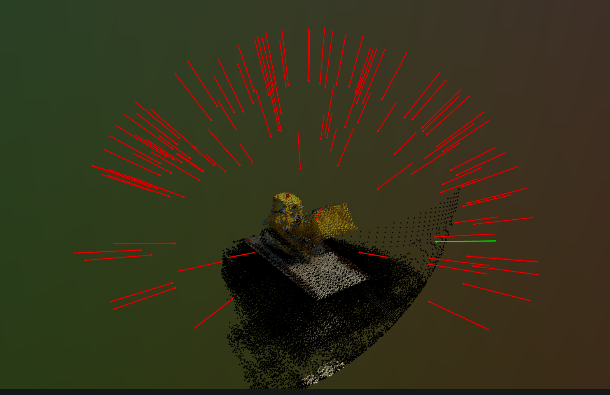

# NERF

This is a simple implementation of a NERF using Jax. 

I wrote this because I wanted to get a better understanding of how NERF's work and to have my own code to play around with.
Starting from scratch helped me better understand more pieces of the puzzle. 


## How to use

To train run: 
```bash
python3 ./nerf/train.py
```

and to visualize:
```bash
python3 ./nerf/render.py --help
```


### Examples

The following example uses the bulldozer dataset from the original nerf paper to train and visualize. 




This next example also plots the camera sphere and the direction of the cameras in the scene. 


